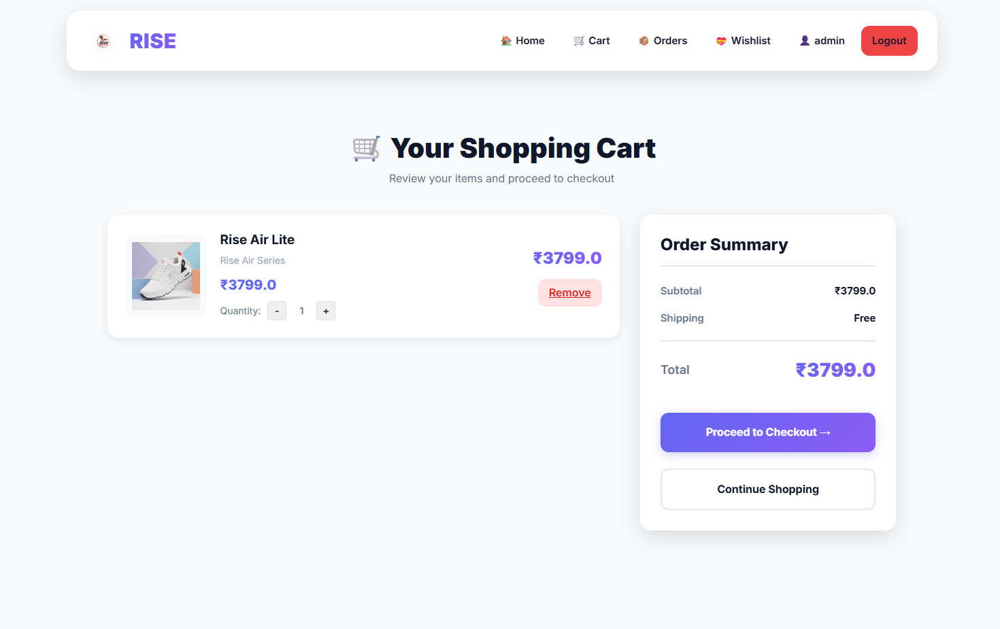
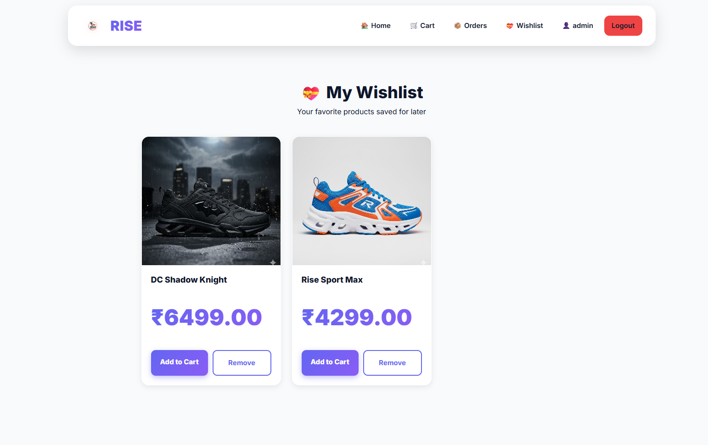
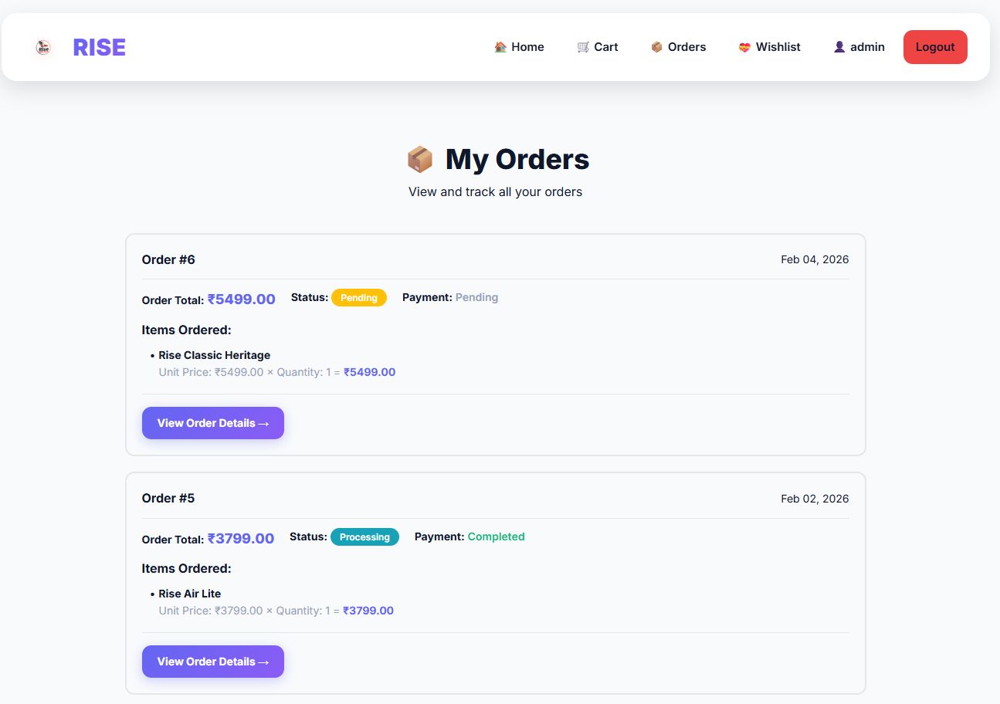
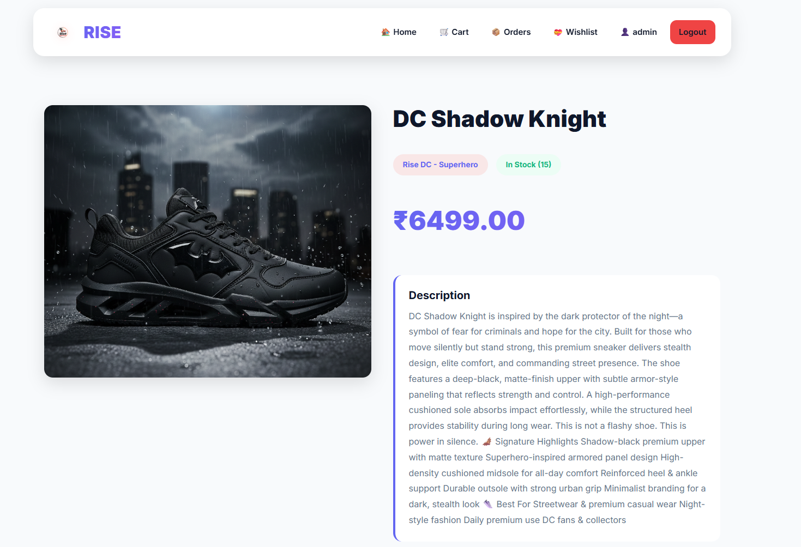
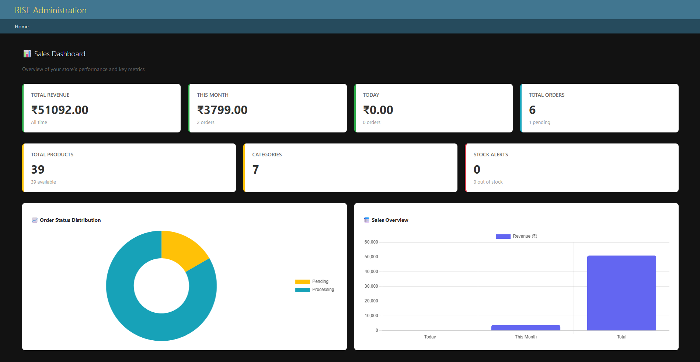

# 👟 RISE – E-Commerce Web Application

🔗 **Live Demo:**  
https://rise-e-commerce-web-application.onrender.com/

---

## 📌 Project Overview

**RISE** is a full-featured Django-based E-Commerce web application designed with a modern UI and production-ready backend architecture.

It includes authentication, cart system, wishlist, order tracking, payment synchronization logic, and a sales analytics dashboard.

This project demonstrates real-world Django development, database integrity handling, admin customization, and cloud deployment.

---

## ✨ Key Features

### 👤 User Features
- User Registration & Login
- Browse Products by Category
- Add to Cart
- Wishlist System
- Checkout Flow
- Order History
- Real-time Payment Status
- Responsive Design

---

### 🛠 Admin Features
- Secure Django Admin Panel
- Order & OrderItem Management
- Bulk "Mark as Paid" Action
- Automatic Payment Synchronization
- Revenue Dashboard
- Order Status Distribution Chart
- Stock Monitoring
- Read-only Protection for Critical Fields
- Delete Disabled for Financial Records

---

## 🔐 Payment Integrity System

This project ensures strict consistency between:

- `payment_status`
- `paid` boolean
- `paid_at` timestamp

### Rules Implemented:
- `paid = True` ONLY when `payment_status = "completed"`
- `paid_at` automatically set when payment is completed
- `paid_at` cleared if payment reverts
- Bulk admin updates handled atomically
- No mismatch possible between frontend and admin

---

## 🖼 Project Screenshots

### 🏠 Homepage
.png)

### 🛒 Shopping Cart

### ❤️ Wishlist

### 📦 My Orders

### 👟 Product Page

### 📊 Admin Dashboard

---

## 🧰 Tech Stack

### Backend
- Python
- Django
- PostgreSQL (Production)
- SQLite (Development)

### Frontend
- HTML
- CSS
- Bootstrap
- JavaScript

### Deployment
- Render

### Version Control
- Git & GitHub

---

## 📂 Project Structure

