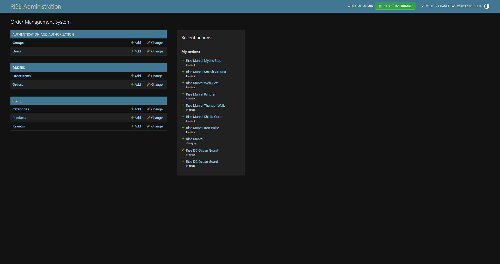
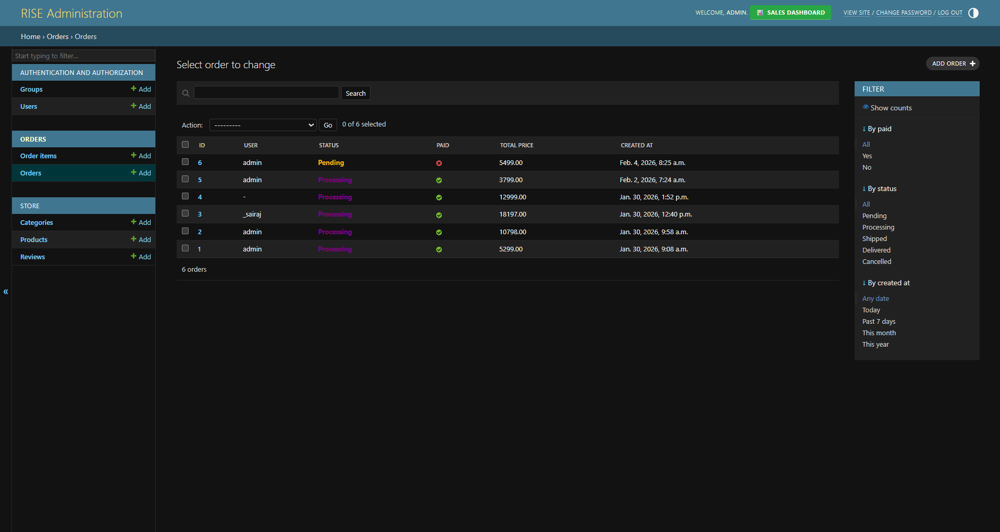
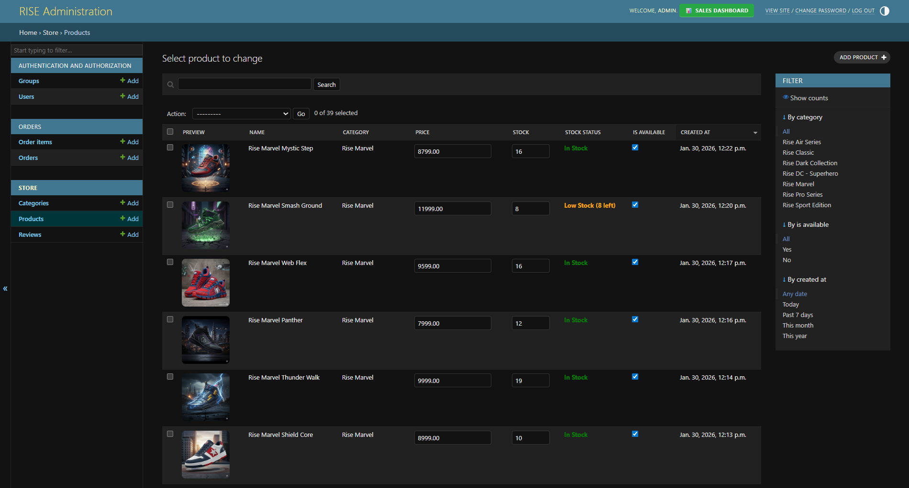
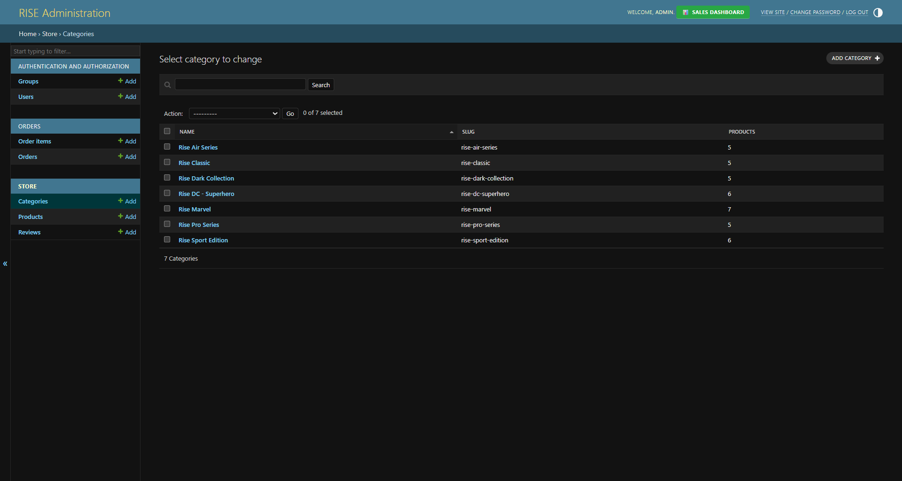
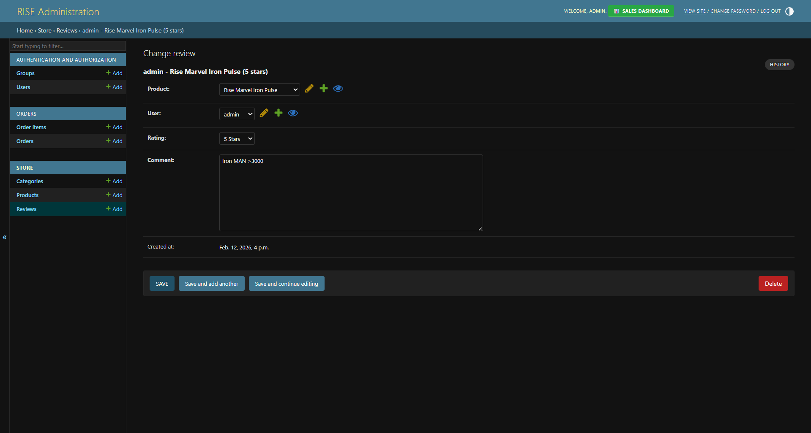

# 👟 RISE – E-Commerce Web Application

🔗 **Live Demo:**  
https://rise-e-commerce-web-application.onrender.com/

---

## 📌 Project Overview

**RISE** is a full-featured Django-based E-Commerce web application built with a modern UI and production-ready backend structure.

It includes authentication, cart management, wishlist system, order tracking, payment status handling, and a custom admin analytics dashboard.

This project demonstrates practical full-stack Django development, admin customization, and deployment on Render.

---

## ✨ Key Features

### 👤 User Features
- User Registration & Login
- Browse Products by Category
- Add to Cart
- Wishlist Management
- Checkout Workflow
- Order History Tracking
- Payment Status Display
- Fully Responsive UI

---

### 🛠 Admin Features
- Secure Django Admin Panel
- Order & OrderItem Management
- Inline Order Items
- Bulk "Mark as Paid" Action
- Revenue Analytics Dashboard
- Order Status Distribution Charts
- Stock Monitoring
- Read-only Protection for Critical Fields
- Delete Disabled for Financial Records

---

## 🖼 Project Screenshots

### 🏠 Homepage

### 🛒 Shopping Cart

### ❤️ Wishlist

### 📦 My Orders

### 👟 Product Page

---

## 🛠 Admin Panel

### 📊 Dashboard

### 🏠 Admin Home

### 📦 Order Management

### 👟 Product Management

### 🏷 Category Management

### ⭐ Review Management

## 🧱 Tech Stack

| Layer | Technology |
|-------|------------|
| Backend | Django (Python) |
| Database | PostgreSQL (Production) / SQLite (Development) |
| Frontend | HTML, CSS, Bootstrap |
| Deployment | Render |
| Version Control | Git & GitHub |

---

## 📂 Project Structure

RISE-E-Commerce-Web-Application/
│
├── myproject/                 # Main Django project folder
│   │
│   ├── accounts/              # User authentication & profiles
│   ├── cart/                  # Cart functionality
│   ├── orders/                # Order & order item management
│   ├── payments/              # Payment status handling
│   ├── store/                 # Products, categories, reviews
│   ├── templates/             # HTML templates
│   │   └── admin/             # Custom admin dashboard templates
│   ├── media/                 # Uploaded product images
│   ├── myproject/             # Project settings & configuration
│   │   ├── settings.py
│   │   ├── urls.py
│   │   └── wsgi.py
│   ├── manage.py
│   ├── requirements.txt
│   └── db.sqlite3             # Development database
│
├── project-images/            # README screenshots
├── .gitignore
└── README.md

---

## 🧠 What This Project Demonstrates

- Full-stack Django development
- Clean database schema design
- Order and payment state handling
- Custom Django Admin configuration
- Dashboard analytics using Chart.js
- Git workflow management
- Cloud deployment on Render

---

## 📈 Future Improvements

- Payment Gateway Integration (Stripe / Razorpay)
- Email Order Notifications
- Coupon & Discount System
- Product Reviews with Ratings
- REST API Version (Django REST Framework)
- Docker Deployment
- Advanced Sales Reporting
- Role-based Access Control
- Search & Filtering Optimization

---

## 👨‍💻 Author

**Krishnakant Gunjal**

GitHub:  
https://github.com/krishnakantgunjal  

LinkedIn:  
https://www.linkedin.com/in/krishnakant-gunjal/

Instagram:  
https://www.instagram.com/krishnakant_gunjal/?__pwa=1

---

## ⭐ Support

If you like this project, consider giving it a ⭐ on GitHub.
